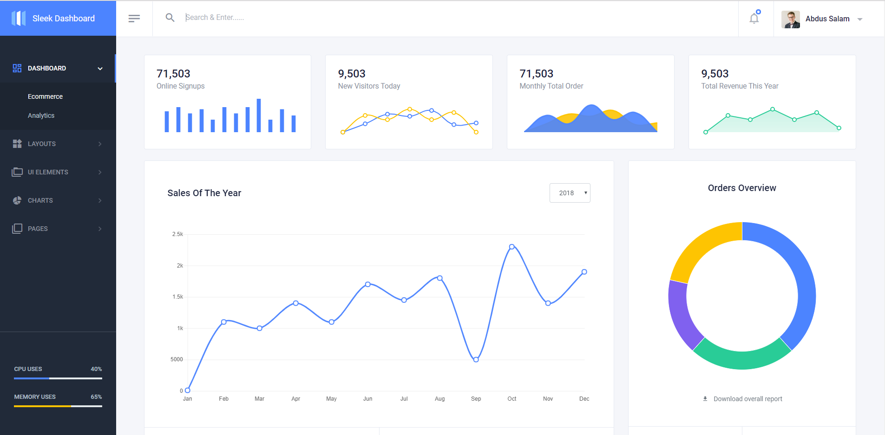
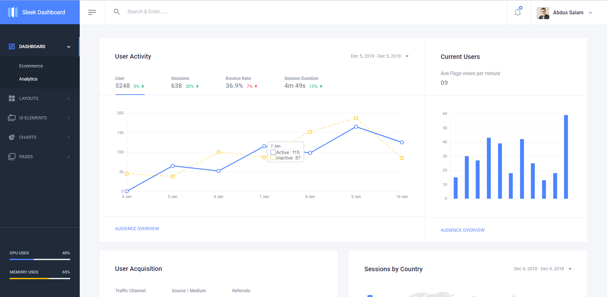
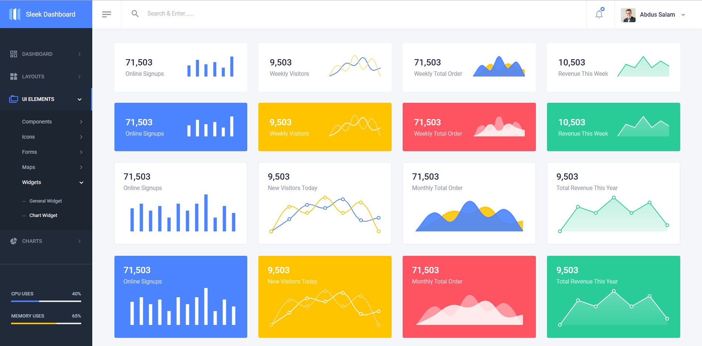
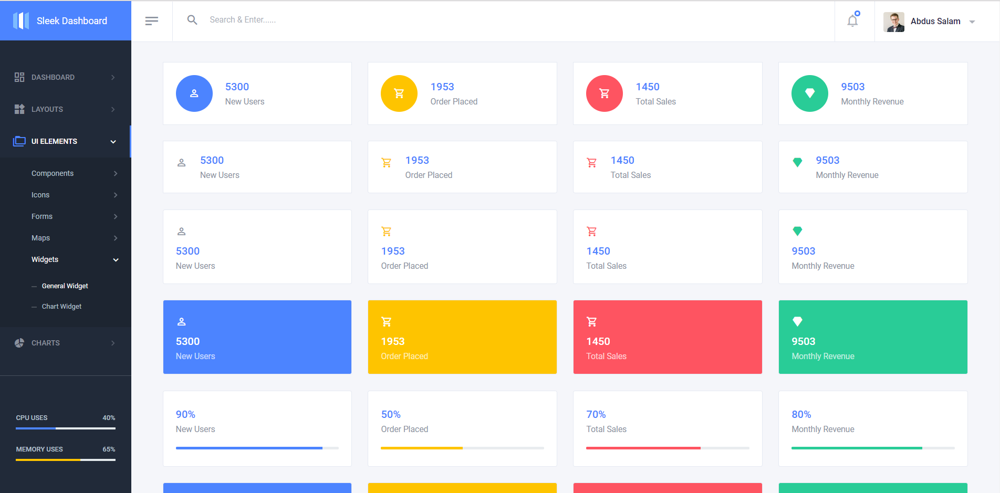

## Table of Contents

- [Demo](#demo)
- [Npm Install](#npm-install)
- [Development](#development)
- [File Structure](#file-structure)
- [Browser Support](#browser-support)
- [Reporting Issues](#reporting-issues)
- [Technical Support or Questions](#technical-support-or-questions)
- [Licensing](#licensing)

## Demo

| Ecommerce  | Analytics  | Chart Widgets  | General Widgets  |
|---|---|---|---|
| [](https://sleek.tafcoder.com/)  | [](https://sleek.tafcoder.com/analytics.html) | [](https://sleek.tafcoder.com/chart-widget.html) | [](https://sleek.tafcoder.com/general-widget.html)

[View More](https://sleek.tafcoder.com/).


## Npm Install
  Install `Sleek Dashboard` from npm
  ```
  npm i sleek-dashboard --save
  ```

## Development
To use our build system and run project locally follow these instructions -

- Install [Node.js and NPM](https://nodejs.org)
- Install [Ruby](https://www.ruby-lang.org/en/documentation/installation/) then install [Bundler](https://bundler.io/) with `gem install bundler`

- Clone github repository with
  ```
  git clone https://github.com/tafcoder/sleek-dashboard.git
  ```


- Navigate to the root `/sleek-dashboard` directory and Install dependency with
  ```
  npm install
  bundle install
  ```

- Finally run `npm start` and open [http://localhost:4000](http://localhost:4000) in your browser. Now you are ready to hack! 

 **Note:** For Windows Read [this guide](https://jekyllrb.com/docs/windows/) to get Jekyll up and running without problems.


## File Structure

Within the download you'll find the following directories and files:

```
sleek-dashboard/
|
|--- dist/ (Distrubution only)
|   |--- assets/
|       |--- css/ (CSS files)
|       |--- img/ (All images)
|       |--- js/ (All images)
|       |--- options/ (for theme option files)
|       |--- plugins/ (for all necessary plugins)
|       |--- scss/ (SCSS files)
|   |--- All html files (index.html, card.html etc.)
|
|--- src/
|   |--- _data/ (for data to use with Jekyll)
|   |--- _includes/ (for Jekyll include files)
|   |--- _layouts/ (for layout files)
|   |--- _plugins/ (contains some Ruby files)
|   |--- assets/
|       |--- css/ (CSS files)
|       |--- img/ (All images)
|       |--- js/ (All images)
|       |--- options/ (for theme option files)
|       |--- plugins/ (for all necessary plugins)
|       |--- scss/ (SCSS files)
|   |--- All html files (index.html, card.html etc.)
|
|--- _config.yaml
|--- Gemfile
|--- Gemfile.lock
|--- package.json
|--- ......
|--- ....

```

## Browser Support

At present, we officially aim to support the following browsers:

    
